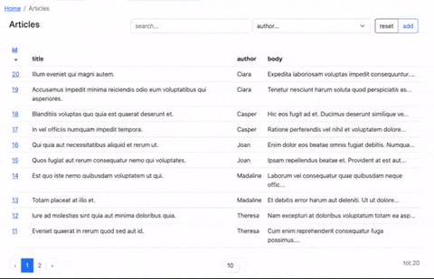

# rapyd-livewire

<a href="https://github.com/zofe/rapyd-livewire/actions/workflows/run-tests.yml"></a>
<a href="https://packagist.org/packages/zofe/rapyd-livewire"></a>
<a href="https://packagist.org/packages/zofe/rapyd-livewire"></a>

[](https://rapyd.dev/demo)


requirements: laravel ^8.65 | 9.* | 10.*

Demo: [rapyd.dev](https://rapyd.dev/demo)


## What is it?

is a laravel library of **blade components**, **livewire traits**, and **modules** scaffolder  that you can use to generate 
administration interfaces in a concise, reusable, uncluttered, and testable manner.

It also bundles standard frontend libraries like 
Bootstrap, Vue, Alpine, Tom Select and Quill to be used as fast boilerplate for your laravel admin panels.

The idea is to speed up and organize the development of large laravel applications:
- **modular approach** (you can organize your backends into reusable modules, isolating everything, components, views, tests, but also translations, migrations, jobs, each module can be like an isolated laravel application)
- **livewire component** based (no needed controllers, each component is naturally reactive, you can get away with few pure livewire classes and blade views, easily testable and maintainable)
- **blade component** based (dozens of available anonymous components to standardize frontend in few "bootstrap based" spacialized tags, which you can eventually extend)

## Modules

example of out of the box module structure you can use after installing rapyd.

- You can create "Modules" folder in you app/ directory of your laravel application.  
- Then you can create your Module Folder i.e.: `Blog`
- Livewire components will be searched in the `Components` subfolder
- You can refer to the views in your module using intuitive shortcut i.e.: `blog::Articles.views.articles_edit`
- Inside your Module folder you can reply (if needed) the laravel application folder structure (controllers, migrations, jobs, etc..)

```
laravel/
├─ app/
│  ├─ Modules/
│  │  ├─ Blog/
│  │  │  ├─ Components/
│  │  │  │  ├─ Articles/
│  │  │  │  │  ├─ views/
│  │  │  │  │  │  ├─ articles_edit.blade.php
│  │  │  │  │  │  ├─ articles_table.blade.php
│  │  │  │  │  │  ├─ articles_view.blade.php
│  │  │  │  │  ├─ ArticlesEdit.php
│  │  │  │  │  ├─ ArticlesTable.php
│  │  │  │  │  ├─ ArticlesView.php
│  │  │  │  ├─ routes.php
```

Rapyd has also some public modules available via "composer require":


* [zofe/demo-module](https://github.com/zofe/demo-module) demo
* [zofe/knowledgebase-module](https://github.com/zofe/knowledgebase-module) knowledgebase 


Rapyd has a "module installer": [zofe/rapyd-module-installer](https://github.com/zofe/rapyd-module-installer)   
this means that you can plan to create & distribute modules as packages by following a simple naming convention.


## Installation

You can install the package via composer:

```bash
composer require zofe/rapyd-livewire
```


You can publish static assets using:
```bash
php artisan vendor:publish --provider="Zofe\Rapyd\RapydServiceProvider" --tag="public"
```

if you want you can download the demo module in your laravel-rapyd application:

```bash
composer require zofe/rapyd-module-installer zofe/demo-module
```
then the route **/demo** will be like this https://rapyd.dev/demo 


## Usage

---
### DataTable
A DataTable is a "listing component" with these features:
- "input filters" to search in a custom data set 
- "buttons" (for example "add" record or "reset" filters)
- "pagination links"
- "sort links" 


```html
<x-rpd::table
    title="Article List"
    :items="$items"
>

    <x-slot name="filters">
      <x-rpd::input col="col-8" debounce="350" model="search"  placeholder="search..." />
      <x-rpd::select col="col-4" model="author_id" :options="$authors" placeholder="author..." addempty />
    </x-slot>

    <table class="table">
        <thead>
        <tr>
            <th>
                <x-rpd::sort model="id" label="id" />
            </th>
            <th>title</th>
            <th>author</th>
            <th>body</th>
        </tr>
        </thead>
        <tbody>
        @foreach ($items as $article)
        <tr>
            <td>
                <a href="{{ route('articles.view',$article->id) }}">{{ $article->id }}</a>
            </td>
            <td>{{ $article->title }}</td>
            <td>{{ $article->author->firstname }}</td>
            <td>{{ Str::limit($article->body,50) }}</td>
        </tr>
        @endforeach
        </tbody>
    </table>

</x-rpd::table>
```
    
props
- `title`: the heading title for this crud

content/slots
- should be a html table that loops model $items
- `buttons`: buttons panel

example: [rapyd.dev/demo/articles](https://rapyd.dev/demo/articles)


---
### DataView
a DataView is a "detail page component" with :  

- "buttons" slot (for example back to "list" or "edit" current record)
- "actions" any link that trigger a server-side  

```html
    <x-rpd::view title="Article Detail">

        <x-slot name="buttons">
            <a href="{{ route('articles') }}" class="btn btn-outline-primary">list</a>
            <a href="{{ route('articles.edit',$model->getKey()) }}" class="btn btn-outline-primary">edit</a>
        </x-slot>

        <div>Title: {{ $article->title }}</div>
        <div>Author: {{ $article->author->firstname }} {{ $model->author->lastname }}</div>
        <div><a wire:click.prevent="someAction">Download TXT version</a></div>
          
    </x-rpd::view>
```

props
- `title`: the heading title for this crud

content/slots
- should be a detail of $model
- `buttons`: buttons panel
- `actions`: buttons panel

example: [rapyd.dev/demo/article/view/1](https://rapyd.dev/demo/article/view/1)


---
### DataEdit
DataEdit is a "form component" usually binded to a model with:  

- "buttons" and "actions" (undo, save, etc..)
- form "fields"
- automatic errors massages / rules management


```html
    <x-rpd::edit title="Article Edit">

       <x-rpd::input model="article.title" label="Title" />
       <x-rpd::rich-text model="article.body" label="Body" />

    </x-rpd::edit>
```

props
- `title`: the heading title for this crud

content/slots
- form fields binded with public/model properties

example: [rapyd.dev/demo/article/edit/1](https://rapyd.dev/demo/article/edit/1)


---


### Fields 

inside some widget views you can drastically semplify the syntax using 
predefined blade components that interacts with livewire

```html
<x-rpd::input model="search" debounce="350" placeholder="search..." />
```

```html
<x-rpd::select model="author_id" lazy :options="$authors" />
```

```html
<!-- tom select dropdown -->
<x-rpd::select-list model="roles" multiple :options="$available_roles" label="Roles" />
or
<x-rpd::select-list model="roles" multiple endpoint="/ajax/roles" label="Roles" />
```

```html
<x-rpd::date-time model="date_time" format="dd/MM/yyyy HH:mm:ss" value-format="yyyy-MM-dd HH:mm:ss" label="DateTime" />

<x-rpd::date model="date" format="dd/MM/yyyy" value-format="yyyy-MM-dd" label="Date" />

```

```html
<x-rpd::textarea model="body" label="Body" rows="5" :help="__('the article summary')"/>
```

```html
<!-- quill wysiwyg editor -->
<x-rpd::rich-text model="body" label="Body" />
```


props

- `label`: label to display above the input
- `placeholder`: placeholder to use for the empty first option
- `model`: Livewire model property key
- `options`: array of options e.g. (used in selects)
- `debounce`: Livewire time in ms to bind data on keyup
- `lazy`: Livewire bind data only on change
- `prepend`: addon to display before input, can be used via named slot
- `append`: addon to display after input, can be used via named slot
- `help`: helper label to display under the input
- `icon`: Font Awesome icon to show before input e.g. `cog`, `envelope`
- `size`: Bootstrap input size e.g. `sm`, `lg`
- `rows`: rows nums
- `multiple`: allow multiple option selection (used in select-list)
- `endpoint`: a remote url for fetch optioms (used in select-list)
- `format`: the client-side field format (used in date and date-time)
- `value-format`: the server-side field value format (used in date and date-time)


## special tags

```html
<!-- sort ascending/descending link actions (in a datatable view context)-->
<x-rpd::sort model="id" label="id" />
```
## navigation

Nav Tabs: bootstrap nav-link menu with self-determined active link

```html
<ul class="nav nav-tabs">
    <x-rpd::nav-link label="Home" route="home" />
    <x-rpd::nav-link label="Articles" route="articles" />
    <x-rpd::nav-link label="Article Detail" route="articles.view" :params="1"/>
    <x-rpd::nav-link label="Article edit" route="articles.edit" />
</ul>
```

Nav Items: boostrap vertical menu items / single or grouped (collapsed)

```html
<x-rpd::nav-dropdown icon="fas fa-fw fa-book" label="KnowledgeBase" active="/kb">
    <x-rpd::nav-link label="Edit Categories" route="kb.admin.categories.table" type="collapse-item" />
    <x-rpd::nav-link label="Edit Articles" route="kb.admin.articles.table" type="collapse-item" />
</x-rpd::nav-dropdown>
```


Nav Sidebar: bootstrap sidebar with self-determined or segment-based active link
```html
<x-rpd::sidebar title="Rapyd.dev" class="p-3 text-white border-end">
   <x-rpd::nav-item label="Demo" route="demo" active="/rapyd-demo" />
   <x-rpd::nav-item label="Page" route="page"  />
</x-rpd::sidebar>
```


## minimal application layout
there are some css/js dependencies (livewire, bootstrap, alpinejs, vuejs)
but rapyd has two directive to simplify all needed inclusions.

Consider to use `{{ $slot }}` as entry-point if you plan to use 
[Full-page components](https://laravel-livewire.com/docs/2.x/rendering-components#page-components)

don't forget to add "app" class to your main div if you plan to use vuejs components

```html
<!DOCTYPE html>
<html lang="en">
<head>
    <meta charset="utf-8">
    @rapydLivewireStyles
</head>
<body>
<div id="app">
   <!-- your main content blade section -->
   {{ $slot ??'' }}
</div>

@rapydLivewireScripts
</body>
</html>
```


## To-do

- component generators (with custom stub for DataTable,DataEdit,DataView)
- "plugin" architecture (a way to download a module from a public or private repository.. or just a composer way to deploy in app/Modules)

## Credits

- [Felice Ostuni](https://github.com/zofe)
- [All Contributors](../../contributors)


Inspirations:

- [rapyd-laravel](https://github.com/zofe/rapyd-laravel) my old laravel library (150k downloads)
- [livewire](https://laravel-livewire.com/)  widely used "full-stack framework" to compose laravel application by widgets
- [laravel-bootstrap-components](https://github.com/bastinald/laravel-bootstrap-components) smart library which reduced the complexity of this one


## License & Contacts

Rapyd is licensed under the [MIT license](http://opensource.org/licenses/MIT)

Please join me and review my work on [Linkedin](https://www.linkedin.com/in/feliceostuni/)

thanks


